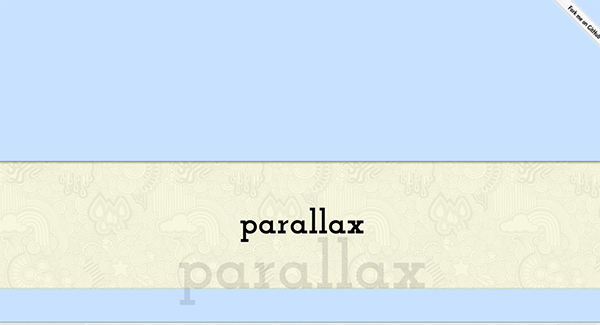
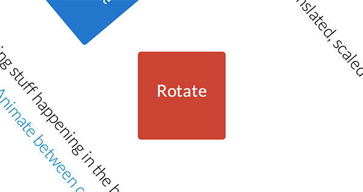
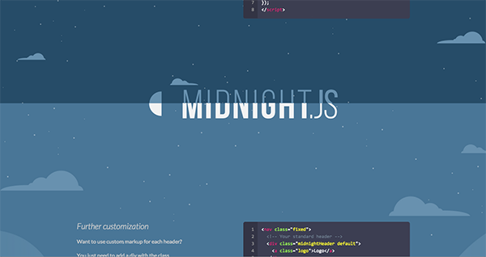

#jQuery Tutorial
---
We worked on this as a group project while teaching ourselves jQuery.
Please note that we assume you have basic knowledge of vanilla JavaScript.

Contributers:

[**Ciara**](https://github.com/cfo613)
| [**David**](https://github.com/DavideDaniel)
| [**Jason**](https://github.com/Jingo88)
| [**Rachel**](https://github.com/r-a-c-h-e-l)
| [**Tiffany**](https://github.com/tiffanyposs)


>"jQuery ... it's just JavaScript..." <br>
>  -Wise Words


## Background and Overview
---
jQuery is a feature-rich JavaScript library created by John Resig in 2006 with the purpose of making JavaScript easier to use, hence the motto: **_Write less, do more._**

It does not replace JavaScript (the code you write in jQuery is still JavaScript), but it does simplify tasks by writing less code.

One of the great things about jQuery is the number of plug-ins available that you can leverage.

Today CSS3 and JS allow you to do many of the things that jQuery was originally made for.

[You Might Not Need jQuery](http://youmightnotneedjquery.com/) is a handy site that compares jQuery to JS and lets you determine if you need jQuery or not.

In this tutorial, we will cover the following basic jQuery concepts:

1. [**Getting Started**](#anchor1) - Implementing jQuery in your site/app
2. [**Basics**](#anchor2) - syntactical overview
3. [**Traversal**](#anchor3) - moving through your document elements
4. [**Events**](#anchor4) - actions that can be detected by your web app
5. [**Effects**](#anchor6) - jQuery methods to create visual effects
6. [**AJAX**](#anchor5) - cross browser integration through jQuery
7. [**Plug-ins**](#anchor7) - JS files that provide useful jQuery methods which can be used along the jQuery core library

<h2 id="anchor1">Getting Started</h2>
---

In order to get started with jQuery you have a couple options to access the jQuery core library.

1. Download the compressed or uncompressed files. jQuery has opinions on which files are better for which purposes.
   You can find out more about that as well as download them at
**[jQuery downloads](http://jquery.com/download/)**.

2. Alternatively you can link to a Content Delivery Network (CDNs). A couple examples would be:
   * **[Google CDN](https://developers.google.com/speed/libraries/devguide#jquery)**
   * **[CDNJS](http://cdnjs.com/libraries/jquery/)**

3. To implement the core library on to your site, link the jQuery library through your HTML file:

	```javascript
	// Example of link to js file in your root directory
	<script src="jquery.js"></script>

	// Example of a link to a CDN
   	<script src="https://ajax.googleapis.com/ajax/libs/jquery/2.1.3/jquery.min.js"></script>
   	```

   **Remember to link your js scripts in the right order!**
   ***
    When linking to jQuery core library, plug-ins and your own script files, remember to structure it so that as the html file is read, the scripts are run in the right order.

   For example, here we link the core library, then plug-ins, and finally our scripts.

  ```js
   <script src="https://ajax.googleapis.com/ajax/libs/jquery/1.11.1/jquery.min.js"></script>
   <script src="jquery-scrollto.js"></script>
   <script src="scroll.js"></script>
    ```


<h2 id="anchor2">Basics</h2>
---
Assuming the reader knows Javascript you'll find striking similarities between the two. That's because jQuery is just a slightly different way to write Javascript.

#####Syntactical overview
***

   What is `$` ?
   Buried in the core jQuery code you'll find this:

```js
window.jQuery = window.$ = jQuery;
   ```

   The jQuery library basically provides the function `jQuery` which as shown above allows `$` to be used as a shorter way to just call the function. Because functions are objects, `$` then has properties and methods which we'll see further through the tutorial.

For example, in order to safely manipulate a page, you will use the `.ready` function.

```js
$( document ).ready(function() { 	 	// This ensures the code inside will only run once
    console.log( "Ready" );			// the page DOM is ready
	});
```
```js
	$(function() {				 // Same thing but not very clear.. why? It's just jQuery!
  		console.log( 'Ready' );		 // but for real, it's adhering to the principle of writing less
	});					 
   ```


The key thing to remember is that jQuery syntax is made for selecting HTML elements and performing actions on html elements.

Basically the syntax is:
`$(selector).action()`

**Note**: You can write JavaScript inside jQuery!

Here's a quick syntax comparison:

	element = document.querySelector('li')		// javascript version
	element = $('li')							// jQuery version

More examples [here](http://youmightnotneedjquery.com/)!

######Syntax for some common things you can do with jQuery
   ***
1. You can grab by html elements, classes or ids.

	```js
$( "#nav-menu" ); // select via ID
$( "div" );      // select all div items on the page
$( "div p" );   // select p items that are inside div
$( ".name" ); // select all elements with a class of "name"
	```

2. You can also grab via DOM elements like children & firstBodyChild. In order to grab a single element:

	```js
var listItems = $( 'li' );
var rawListItem = listItems[0]; // or listItems.get( 0 )
var html = rawListItem.innerHTML;
	```
	 or

	```js
var listItems = $( 'li' );
var secondListItem = listItems.eq( 1 );
secondListItem.remove();
	```

3. Example of creating a new element in jQuery:

  ```js
  $( "<p>", {				// create the element
  html : "Hello World",	  // call on html to change the  innerHTML
  "class": "greeting",	   // assign the class -- note that class & id go in quotes
  "id": "my_greeting"	    // assign the id
  );

  $( ".name" ); 			// select all elements with a class of 'name'
	```

4. There are 2 types of methods:
   * Getters - methods that grab elements from the document `var first = listItems.get(0)`
   * Setters - change the selection in some way `$( "li" ).html = "examples"`

5. Iterating through the elements

	```js
// grab all li and change inner HTML to string "I'm a string"
$( "li" ).html( "I'm a string" );
	```

6. One cool thing about jQuery is the ability to chain methods. For example:

	```js
$( 'li' )	 								// grab li
  .click(function() {    						// when li element is clicked
$( this ).addClass( 'clicked' );    	// add a class to the li called ".clicked"
	})
.find( 'span' )							    // use .find method to select spans within li
.attr( 'title', "Hover over me" );			// set title to "Hover over me"
 	```

<h3 id = "ex1" >Excercise 1</h2>
---
***
[Clone this linked repo for ease](https://github.com/JqueryJellybeans/jqueryExcercises)

####[Toggle demo](https://github.com/JqueryJellybeans/jquerytutorial/tree/master/examples/toggleExample/v1.html)

---
***
<h2 id="anchor3">Traversal</h2>
---
jQuery lets us traverse or "move through" the html elements on our page.

#####Moving through your document elements
***
 Let's set an example html frame:

```html
<body> 							// ancestor of all, parent of div.d01, div.d02 and div.d03
	<div class = "d01">  		    		    // child of body, parent of h3, sibling of d02 and d03
    	<h3>I'm a little string, short and stout</h3> 		  	  		  // descendent of div.d01
	</div>
	<div class = "d02"	 		    	    // child of body, parent of h3, sibling of d01 and d03
  		<h3>I'm a little string too, but I don't pout</h3> 	                  // descendent of div.d02
	</div>
	<div class = "d03"	 			    // child of body, parent of h3, sibling of d01 and d02
		  <h3> The End </h3> 							   //descendent of div.d03
	</div>
</body>
  ```

1. You can find elements relative to a selection. Some examples are:

  ```js
	// get the first div on the page
	var firstDiv = $( 'div' ).first(); // you can also use .last() to pick the last

	// get the siblings
	var siblings = firstDiv.siblings();

	// get the next sibling
	var nextSibling = firstDiv.next(); // you can also use .prev() to pick the previous

	// get the parent
	var body = firstDiv.parent();

	// get the elements that are immediate children
	var divs = body.children();

	// get ALL h3s on the page
	var allh3s = body.find( 'h3' );
	```
2. Every div has its own index, and can be located directly by using `eq(index)` method. For example:

  ```js
$("div").eq(1)		// remember that indexes start from 0 so that is div.d02
	```

3. You can also use the find (selector) method to find the elements.

  	```js
 // This says find all p elements inside all divs and add class "selected"
 $("div").find("p").addClass("selected");  

   	```
4. The filter(selector) method allows to... filter out elements!

```html
	<script type="text/javascript" language="javascript">    //it's just Javascript!
   		$(document).ready(function() {
   		// get all divs, filter the bottom class and add class "selected" to them
      	$("div").filter(".bottom").addClass("selected");  
   		});
   	</script>
	<style>
      	.selected { background-color:blue; }  	// now you can change the color of the div with a toggle!
   	</style>
	</head>
	<body>
     		<div class="top">list item 1</div>
     		<div class="middle">list item 3</div>
     		<div class="bottom">list item 5</div>
   	</body>
   	</html>
   ```


   Read on to learn about toggling!

---

<h2 id="anchor4">Events</h2>
---

jQuery allows you, the developer, to write code easily for users to interact with the webpage. Some of the more common event methods are:

* `.click()`
* `.keyup()`
* `.keydown()`
* `.keypress()`
* `.scroll()`
* `.mouseenter()`
* `.mouseleave()`
* `.mouseover()`

The syntax for these methods are usually written as "$('element that is selected')(event type)(function);" An example is below.

  ```js
  $('button').click(function(){
  	alert('Hello World');
  })


  $('#image').mouseover(function(){
  $('#image').slideUp(2000, 'linear');
  })

  $('input').keypress(function(evt){
  if (evt.key === 13){
  	alert("you pressed enter");
  }
  })
  ```

#### Binding and Unbinding
***

If there is a scenario where you need an element to have an event listener, and then eventually remove that event listener, you can utilize the bind and unbind methods.

1. `.bind()` - this method will act similar to the event listener methods above, the only exception is the event type is not a handler. It is written as (selector).bind(event type, function). An example is below:

	```js
	$('button').bind("click", function(){
		alert("you have clicked the button");
	})
	```
2. `.unbind()` - this method will remove the event listener from an element. It can be written as (selector).unbind(event type, function). With unbind, the second parameter is not required. An example is below:

	```js
	$('button').unbind('click');
	```


<h2 id="anchor6">Effects</h2>
---

#### Fading Effects

* `.fadeIn()` - fadeIn method takes two parameters .fadeIn([duration], [function]). The duration can be written in milliseconds, or "fast" and "slow". The second parameter (function) is optional, and if used will be a callback function.  

* `.fadeOut()` - the fadeOut method will be written the same way as the fadeIn, but has the opposite effect. The parameters it takes in are also the same. The two methods will look like this.

	```js
	$('#divFade').fadeIn(2000)

	```

	```js
	$('#divFade').fadeOut(2000)
	```

	With a second parameter the code may look like:

	```js
	$('#divFade').fadeIn(2000, function(){
        $('#divFade').fadeOut(2000);
    })
	```

* `.fadeToggle()` - luckily with the jQuery framework we also have the fadeToggle method. This is especially handy when you want a div to fade in and out. It is also written with the same parameters as the fadeIn and fadeOut methods:

	```js
	$('#divFade').fadeToggle(2000);

	```

* `.fadeTo()` - can take up to three parameters:

	```js
	.fadeTo([duration], [opacity], [function]).
	```

One thing to note is that all four of these methods will also run without any parameters. Pretty cool!


#### Sliding Effects

* `.slideUp()`
* `.slideDown()`
* `.slideToggle()`

Examples for all three are show below:

```js
$('#slideMe').slideUp(2000, "linear");
```
```js
$('#slideMe').slideDown(2000, "swing");
```
```js
$('#slideMe').slideToggle();
```

The format for these three methods can take up to three parameters, or none at all.

* First parameter: the speed that the sliding effect completes at. It can be written in milliseconds, "fast" or "slow".
* Second parameter: the easing parameter. There are two options, "swing" and "linear". By using "swing" the sliding effect will be slow in the beginning and end, but fast in the middle. The "linear" easing will keep the sliding effect at a constant speed throughout. If there is no defined easing parameter it will slide in the "swing" motion.
* Third parameter:  a callback function to be executed when the sliding effect is completed.


#### The Animate Method
* `.animate()` - jQuery comes with a very handy animate method. The method accepts up to three parameters. It will be written as `.animate({parameters}, speed, [function]);`.
	* First parameter: an object of the changing animations. You can utilize various css values inside the curly brackets and their movements
	* Second parameter: the speed at which the animations will take place, and the function will be executed when the effects are completed.
	* Third parameter: the complete callback function that is called once the animation is complete. This parameter is optional.


	An example is shown below:

	```js
	$('#movingDiv').animate({
	left: '250px',
	top: '100px',
	opacity: '0.5',
	}, 2000)
	```


* `.stop()` - the stop method will stop the current animation as it stands. You can utilize this method if you have an animation, and provide the user a button to pause the animation. stop() can have up to two parameters, or take none at all. Both parameters are boolean values that will take true or false. The first parameter determines if you want to pause the animation or "clear the queue" and the second parameter determines if you want to jump to the end of the animation or not. For example:

	```js
	$('#movingDiv').stop(true, false);
	```

* `.finish()` - the finish method is similar to the stop method. When called, it will stop the currently-running animation, remove all queued animations, and complete all animations for the matched elements.

	```js
	$('#movingDiv').finish();
	```

<h2 id = "ex2" >Excercise 2</h2>
---
***
[Clone this linked repo for ease](https://github.com/JqueryJellybeans/jqueryExcercises)

####[Scrolling](https://github.com/JqueryJellybeans/jquerytutorial/tree/master/examples/scroll/scroll.html)

####[Parallax](https://github.com/JqueryJellybeans/jquerytutorial/tree/master/examples/parallax/test.html)

---

<h2 id="anchor5">AJAX & jQuery</h2>
---

The days of refreshing a webpage to load content are gone. AJAX, short for Asynchronous JavaScript and XML allows the user to take data from the background and load it to your webpage. Since the Ajax requests are triggered by JavaScript code, it is asynchronous, and the rest of your code will continue to execute at the same time.

AJAX is handled differently between browsers. jQuery allows developers to get around this by offering methods such as the .ajax(), .get(), .getScript(), .getJSON(), .load() to name a few.

The .ajax() method is a way of creating an asynchronous http request. Make sure that the data received from the server is in the format that you requested; if not your code may fail. The .ajax() method is written as so: `jQuery.ajax(url[settings])`. There are a plethora of settings developers can input when using the method. For a full list of these settings, and their parameters you can go [here](http://api.jquery.com/jQuery.ajax/). One example of this methods utilization is:

```js
$.ajax({
	statusCode: {
		404: function() {
			alert("sorry the page was not found");
		}
	}
});
```

When making an Ajax request two common methods are GET and POST. GET is used for operations that is only getting data from the server, but not changing data on the server. POST is used for operations that will change data on the server. For example, a client editing a blog post. Along with the `.ajax()` method in the jQuery Ajax, we also have the `.load()` method. This is written like `(selector).load(url, data, callback)`.

You can also bind Ajax events to elements in the same fashion you would bind other events. You may want to use this if you ever find yourself needing to start or stop an operation whenever an Ajax request is called. Check out [AJAX Events](http://api.jquery.com/Ajax_Events/) for more documentation about the various event triggers.

One thing to note is that Ajax does not work with all domains. For this issues we can use the .jsonp() method (JSON with Padding). This uses script tags to load files with other JS and JSON content from another domain. Browsers have begun to implement a new technology called CORS(Cross Origin Resource Sharing), which allows Ajax request to different domains.

---
---

<h2 id="anchor7">Plug-ins</h2>
---
###Links

Here are some examples of plugins that use jQuery to build powerful effects:


###[ScrollMagic](http://janpaepke.github.io/ScrollMagic/)  
Scroll Magic is a plugin that allows you to render multiple effects while scrolling down a page.


###[oriDomi](http://oridomi.com/)  
This plugin allows you to crumple an image on the screen like a piece of paper.


###[Zoomooz.js](http://jaukia.github.io/zoomooz/)  
Zoomooz allows you to zoom and manipulate screen position.


###[midnight.js](http://aerolab.github.io/midnight.js/)  
Midnight allows you to switch fixed headers as you scroll down the page.


###[vide](http://vodkabears.github.io/vide/)  
This allows you to add video backgrounds to your page.


###[parallax.js](http://matthew.wagerfield.com/parallax/)  
Parallax.js allows you to create depth and motion to your site that reacts to cursor and smart device movement. Check it out!

###[jQuery Plug-ins](http://plugins.jquery.com/)
###[NPM jQuery Plug-ins](https://www.npmjs.com/browse/keyword/jquery-plugin)
